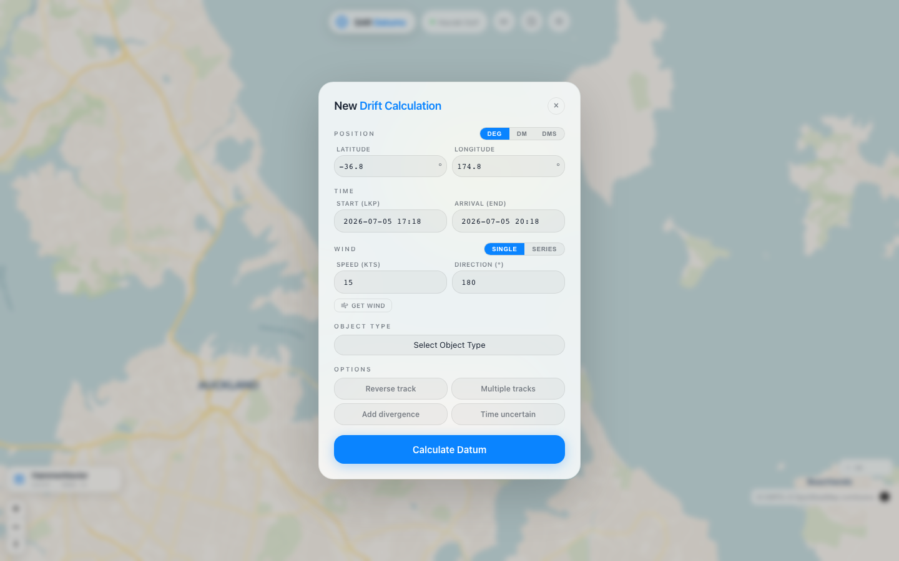
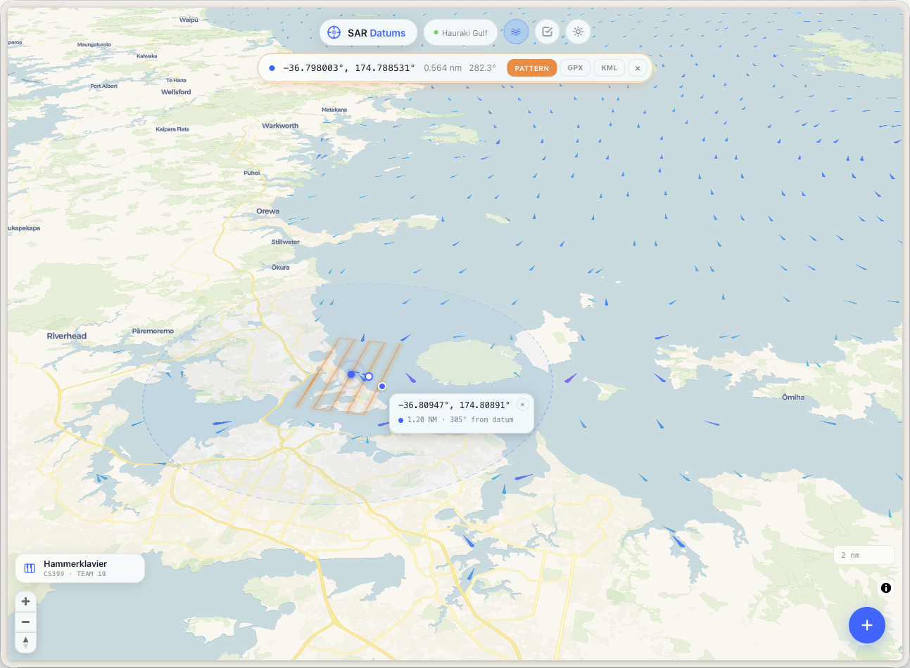

<div align="center">

# SAR Datums

**A web-based drift-prediction tool for maritime search & rescue planning.**

Replaces a legacy Excel/VBA leeway model with an interactive map, live tidal-current data, and automatic search-pattern generation.

[](#)
[](#)
[](#)
[](#)
[](#)




</div>

## What it does

Given a **last known position**, a **time window**, **wind conditions**, and the type of object in the water (person, life raft, kayak, oil drum...), SAR Datums predicts where that object has drifted to — combining:

- **Leeway** — direct wind-driven drift, using per-object leeway coefficients (117-entry object catalogue: PIW, life rafts, person-powered craft, debris, etc.)
- **Tidal currents** — real current-vector data sampled at the predicted position and time
- **Divergence** — optional left/right divergence tracks for uncertain leeway angle

...and outputs a predicted **datum** (drift track), downloadable as **GPX/KML** for direct import into a GPS or chartplotter, plus an automatically generated **search pattern** (creeping line, expanding square, sector search, or expanding circle) sized by a sweep-width calculator that accounts for visibility, sea state, and searcher fatigue.

The physics/leeway model is validated **against a reference Excel/VBA spreadsheet** already in use by search & rescue volunteers — the app includes an accuracy-comparison endpoint that diffs its predicted track against a reference GPX to confirm the two stay in agreement.

## Features

- 🗺️ Interactive map (MapLibre GL) centred on the Hauraki Gulf, with live tidal-current overlay
- 📍 Drift prediction from a single datum, or a ring of satellite start points for spread estimation
- 🌊 Tidal current + tide height data, queried spatially with PostGIS
- 🧭 Four SAR search pattern generators: creeping line, expanding square, sector search, expanding circle
- 📐 Sweep-width calculator (object type, visibility, height of eye, wind, sea state, fatigue, asset count)
- 📤 GPX / KML export, ready for GPS devices and chartplotters
- ✅ Built-in accuracy check against the original Excel/VBA reference implementation
- 🌤️ Live wind lookup via the Open-Meteo API

## Tech stack

| Layer | Tech |
|---|---|
| Backend | Python, Flask |
| Database | PostgreSQL + PostGIS (spatial indexing on tidal vectors & locations) |
| Frontend | Vanilla JS, MapLibre GL JS, Flatpickr |
| Data | Tidal vectors & heights imported from source spreadsheets; SAR object catalogue (117 entries) |

## Architecture

```
app.py                  Flask routes / API
domain/model.py         Coordinate, Wind, SearchObject, CurrentVector
services/
  drift.py              Leeway + tidal-current drift simulation
  circ.py, lne.py, sect.py, squ.py, sweep.py    Search-pattern generators
  gpx.py, kml.py        Track export
  accuracy.py           Compare predicted track vs. reference GPX
  wind.py               Open-Meteo wind lookup
database/
  db_config.py          Local / AWS connection targets
  schema.sql            PostGIS schema
  parse_tidal_data.py, parse_tide_heights.py, import_objects_csv.py   Data importers
ui_ux/                  Map UI (HTML/CSS/JS)
```

## Setup

**Requirements:** Python 3.11+, PostgreSQL 18 with PostGIS.

```bash
git clone https://github.com/dvhahn/sar-datums.git
cd sar-datums
python3 -m venv venv && source venv/bin/activate   # Windows: venv\Scripts\activate
pip install -r requirements.txt
```

Then set up the database (full step-by-step in [`docs/DATABASE_SETUP.md`](docs/DATABASE_SETUP.md)):

```bash
brew install postgresql@18 postgis
createdb sar_datums
psql sar_datums -c "CREATE EXTENSION postgis;"
psql sar_datums -f database/schema.sql
python database/parse_tide_heights.py <excel_path>
python database/parse_tidal_data.py <excel_path>
python database/import_objects_csv.py data/objects.csv
```

Run it:

```bash
python app.py
# → http://localhost:5000
```

## My contribution

This was built as a 5-person capstone project (COMPSCI 399, University of Auckland) for a real search & rescue use case. My main areas:

- The map-based frontend (`ui_ux/` — drift calculation UI, MapLibre integration, currents overlay)
- Flask API routes (`app.py`)
- The core drift/leeway simulation (`services/drift.py`)
- GPX export and the expanding-square / creeping-line search patterns
- Database schema work
